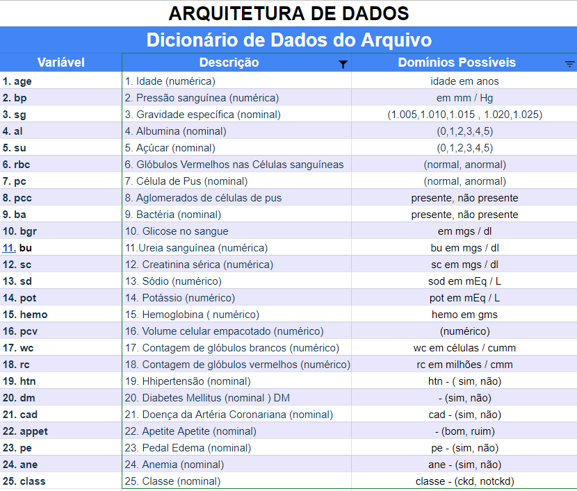
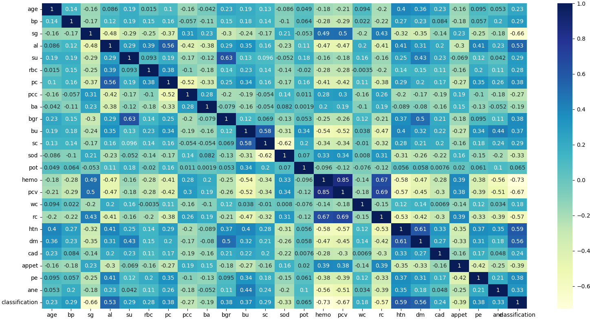
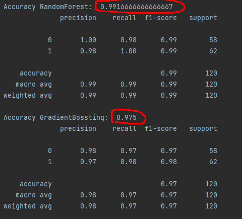
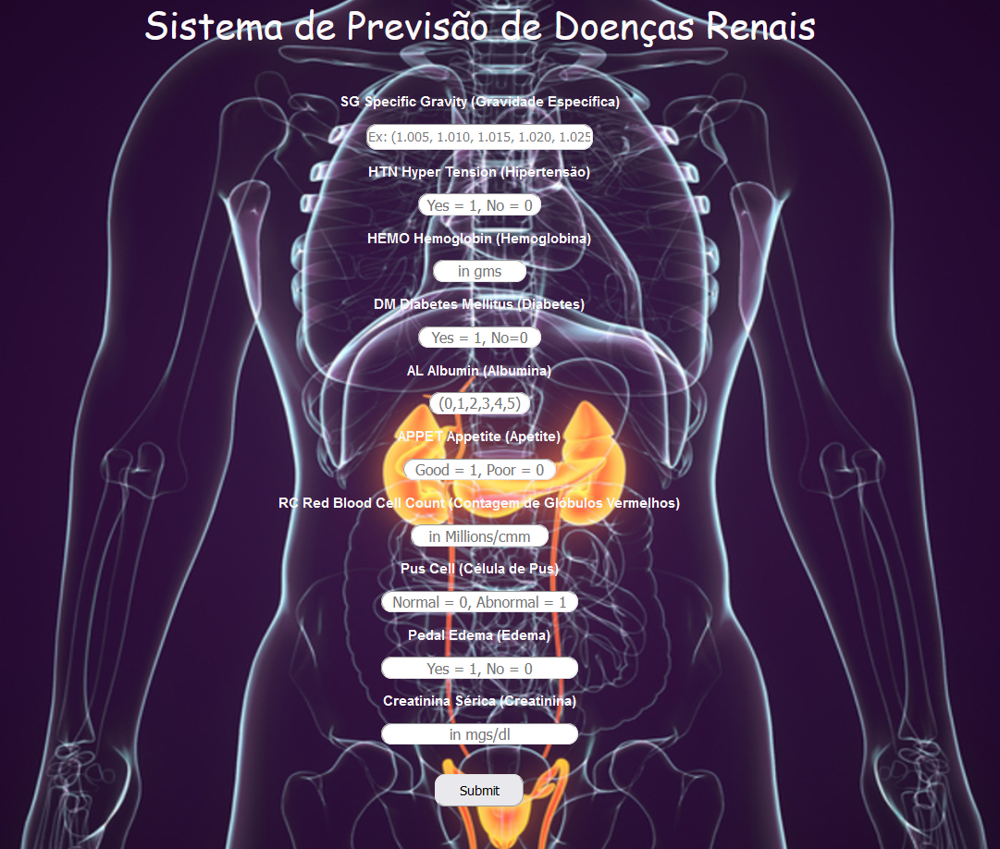
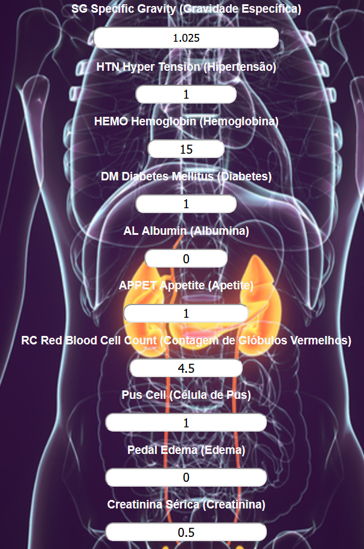
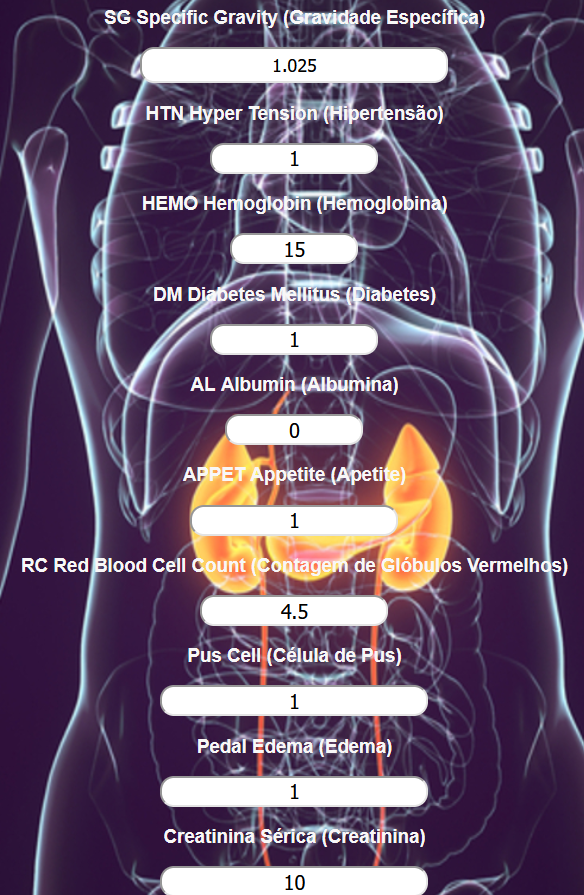

# Sistema de Previsão de Doenças Renais

Este sistema utilizará Aprendizado de Máquina para informar se um paciente tem predisposição para possuir alguma doneça
renal.
Este projeto foi desenvolvido com a finalidade de validar o entendimento e o exercitar após assistir as aulas da Jornada Ciência de Dados. 

## Fonte de Dados - Dataset

[Chronic Kidney Disease Dataset](https://archive.ics.uci.edu/ml/datasets/Chronic_Kidney_Disease)

## Descrição do Dataset 

[Download Description](https://archive.ics.uci.edu/ml/datasets/Chronic_Kidney_Disease#)

## Tecnologias Utilizadas

- Python
- Machine Learning
- Pandas
- Numpy
- Scikit-learn
- Flask
- HTML
- CSS

## Problemática do Negócio

<p>
O <b>DataHealthcare Group</b> é um grande Conglomerado Internacional da área da saúde. Atualmente, possui cerca de 100 mil funcionários, e presta serviços de saúde para 75 milhões de pessoas, atuando em 50 estados americanos e 17 nações ao redor do mundo.
O grupo atua em diferentes mercados, tais como: Hospitais, planos de saúde e benefícios para empregados, militares e aposentados, sistemas de tecnologia da informação em saúde, e programas de saúde para o setor público, dentre outros.
</p>
<p>
Em 2021, foi a maior empresa do ramo de saúde do mercado americano a frente de empresas como WellPoint Inc., CIGNA Health Insurance Company entre outras.
Atualmente, o Grupo Adquiriu um Hospital <b>especializado em Nefrologia</b> para atuar nesse ramo, que é considerada uma das categorias com maiores demandas no mercado de saúde.
Fui <b>contratado como Cientista de Dados para, em conjunto com a junta de Nefrologistas, desenvolver um Sistema de Previsão de Doenças Renais</b> para auxiliar os médicos na identificação das doenças crônicas dos rins.
</p>
<p>
Neste ponto, o objetivo inicial é discutir e entender quais são as variáveis que os Nefrologistas consideram as mais importantes para diagnosticar se um paciente possui Doença Renal.
É muito comum serem listadas dezenas quiçá centenas de variáveis que podem impactar direta ou indiretamente na ocorrência de doenças renais.
A partir de agora, será considerado que chegamos num ponto no qual podem-se iniciar os trabalhos com as variáveis já identificadas como relevantes para o processo.
</p>

## Análise Exploratória dos Dados

<p>
Inicialmente foi necessário entender alguns pontos:
</p>
<ul>
    <li>
    Onde os dados estão armazenados;
    </li>
    <li>
    Como será realizada a conexão com os dados;
    </li>
    <li>
    Conhecer a distribuição dos dados;
    </li>
    <li>
    Verificar insconsistências/erros dos dados informados.
    </li>
</ul>
<p>
Os dados foram obtidos através de um arquivos .csv contendo informações dos pacientes.
</p>
<p>
Abaixo temos um dicionário contendo informações sobre os dados disponibilizaods e a arquitetura deles.


</p>
<p>
Foi identificado que a coluna 'classification' contém a informação sobre a presença ou não de alguma doença renal no paciente.
</p>
<p>
Utilizei Pandas, Numpy e Seaborn para identificar, calcular e visualizar dados importantes que servem como preparação para a etapa de Pré-Processamento.
</p>
<p>
Estudando as variáveis do dataset utilizado, idenficou-se que será necessário remover algumas colunas, dar replace em alguns valores e substituir valores vazios.
</p>


## Pré-Processamento dos Dados
<p>
Nesta etapa foram realizadas as seguintes tratativas:
</p>
<ul>
    <li>
    Eliminada coluna 'id' (desnecessária para o modelo);
    </li>
    <li>
    Conversão de tipos de colunas para números (objects para float ou int);
    </li>
    <li>
    Criada variável 'colunas' para auxiliar no tratamento de valores nulos;
    </li>
    <li>
    Substituídos valores nulos pela mediana da coluna.
    </li>
    <li>
    Criei um gráfico heatmap para verificar se existem variáveis multicolineares, 
    com isso foi possível identificar que as variaveis 'pcv' e 'hemo' possuem 85% de 
    multicolinearidade (ver imagem abaixo);</br></br>
    </li>


    <li>
    Optei por remover a variável 'pcv' do modelo por conta da multicolinearidade com a variável 'hemo';
    </li>
    <li>
    A coluna 'classification' foi definida como target para o modelo preditivo e as demais colunas foram definidas como variáveis explicativas.
    </li>
</ul>

## Construção e avaliação da máquina preditiva
<p>
Nesta etapa foram realizados os seguintes procedimentos:
</p>
<ul>
    <li>
    Utilizando ranked_features, defini as 10 melhores variáveis para o aprendizado e teste do modelo: 'sg', 'htn', 'dm', 'hemo', 'al', 'appet', 'rc', 'pc', 'pe', 'sc';
    </li>
    <li>
    Criei duas variáveis de treino para X e Y e também duas variáveis de teste para X e Y;
    </li>
    <li>
    Utilizando train_test_split separei uma amostragem dos dados para treinamento da máquina preditiva;
    </li>
    <li>
    Utilizei dois algoritmos para comparação e escolha do que possuir melhor acurácia. Um com RandomForest e outro com GradientBoosting;
    </li>
    <li>
    Os resultados de acurácia foram bem próximos, porém o primeiro modelo foi melhor que o segundo;</br></br>
    </li>


    <li>
    Realizei a explortação de ambos os modelos utilizando pickle.
    </li>
</ul>

- Foi criado o arquivo app.py, onde será utilizado Flask para renderizar uma página html com um formulario para inserção dos dados:</br></br>
</br></br>
- Após o processamento dos dados inseridos, o resultado será mostrado na página result.html de acordo com o resultado retornado pela máquina preditiva:</br></br>
  - Resultado se saudável:
  </br></br>
  - Resultado se não saudável:</br></br>
  

## Parâmetros para testes

### Pessoa saudável

- Utilize os valores conforme mostrados na imagem abaixo:


### Pessoa não saudável

- Utilize os valores conforme mostrados na imagem abaixo:


## Como executar o sistema - Running Tests

Para rodar o sistema, basta digitar o comando abaixo npor linha de comando: 

```
python app.py (tecle enter)
```

- Após executar o app.py por linha de comando, será mostrada uma mensagem infromando que o servidor estará on-line e pronto para uso, basta entrar no endereço http://127.0.0.1:5000/ em qualquer navegador para ir para a página inicial.

# Fim...
- David Couto
- coutodwsc@gmail.com